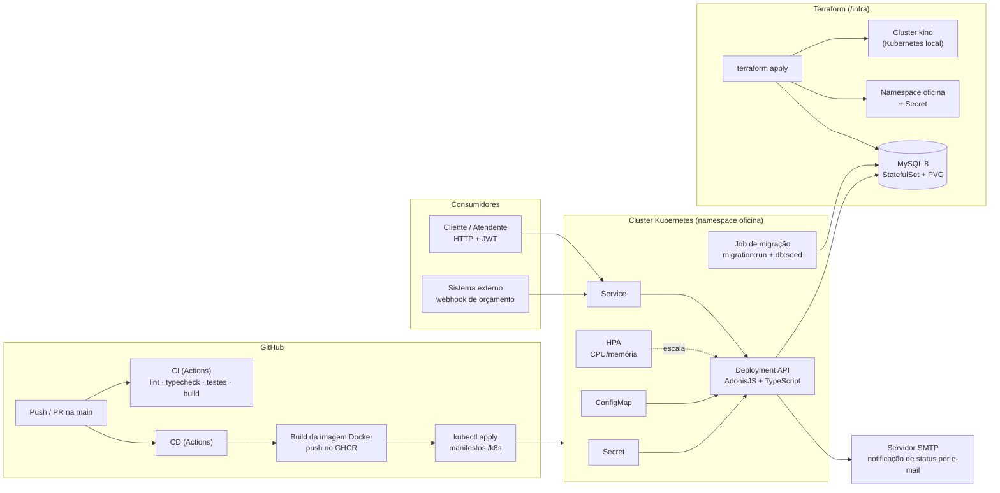

# API - Oficina Mecânica (Tech Challenge - Fases 1 e 2)

MVP do back-end de um **Sistema Integrado de Atendimento e Execução de Serviços** para uma
oficina mecânica. Permite gerir **Ordens de Serviço (OS)**, clientes, veículos, serviços e
peças/estoque, com autenticação JWT, documentação Swagger e empacotamento via Docker.

Desenvolvido com **AdonisJS v6 + TypeScript**, banco **MySQL** (via Lucid) e arquitetura
**Domain-Driven Design (DDD)** com Linguagem Ubíqua em português.

---

## Sumário

- [Fase 2 — Objetivos](#fase-2--objetivos)
- [Arquitetura da solução (Fase 2)](#arquitetura-da-solução-fase-2)
- [Documentação](#documentação)
- [Collection das APIs](#collection-das-apis)
- [Arquitetura](#arquitetura)
- [Por que MySQL](#por-que-mysql)
- [Como executar com Docker](#como-executar-com-docker-recomendado)
- [Como executar localmente](#como-executar-localmente)
- [Autenticação](#autenticação)
- [Endpoints](#endpoints)
- [Deploy em Kubernetes](#deploy-em-kubernetes)
- [Provisionamento com Terraform (IaC)](#provisionamento-com-terraform-iac)
- [Testes e cobertura](#testes-e-cobertura)
- [Segurança](#segurança)

---

## Fase 2 — Objetivos

Com o aumento da demanda, a expansão para novas unidades e a necessidade de alta
disponibilidade, a Fase 2 evolui a aplicação da Fase 1 para garantir **qualidade, resiliência e
escalabilidade**, incorporando práticas modernas de infraestrutura e automação:

- **Refatoração** aplicando Clean Code e Clean Architecture, com testes automatizados cobrindo
  os fluxos críticos;
- **APIs**: abertura de OS, consulta de status, aprovação/recusa de orçamento (notificação
  externa), listagem ordenada por status (Em Execução > Aguardando Aprovação > Diagnóstico >
  Recebida, mais antigas primeiro, sem finalizadas/entregues) e atualização de status via
  e-mail;
- **Conteinerização**: `Dockerfile` e `docker-compose` revisados;
- **Kubernetes** (`/k8s`): Deployments, Services, ConfigMaps/Secrets e HPA (escala por
  CPU/memória);
- **Terraform** (`/infra`): provisionamento do cluster Kubernetes e do banco de dados;
- **CI/CD**: pipeline com build, testes, build da imagem Docker e deploy (aplicação, banco e
  manifestos) no cluster.

O enunciado completo da fase está em
[`docs/tech-challenge-fase-2.md`](./docs/tech-challenge-fase-2.md).

---

## Arquitetura da solução (Fase 2)

Componentes da aplicação, infraestrutura provisionada e fluxo de deploy:



- **Componentes:** API monolítica modular (Clean Architecture, bounded contexts), MySQL 8 e
  notificação por e-mail (SMTP via nodemailer).
- **Infraestrutura provisionada (Terraform):** cluster kind, namespace, Secret e MySQL — ver
  [`infra/README.md`](./infra/README.md).
- **Fluxo de deploy:** push na `main` dispara o CI (qualidade) e o CD, que publica a imagem no
  GHCR e aplica os manifestos de [`/k8s`](./k8s) no cluster (Deployment, Service, ConfigMap,
  Secret, HPA e Job de migração).

---

## Documentação

| Documento | Conteúdo |
| --- | --- |
| [Documentação da Fase 1](./docs/documentacao-fase-1.md) | Documento de entrega: visão geral, Linguagem Ubíqua, fluxos DDD por contexto e relatório SonarQube |
| [Enunciado da Fase 2](./docs/tech-challenge-fase-2.md) | Requisitos obrigatórios e entregáveis da Fase 2 |
| [ADR 0001 — Arquitetura Orientada a Eventos](./docs/adr/0001-arquitetura-orientada-a-eventos.md) | Decisão de arquitetura de eventos de domínio |
| [Mapa de Contexto](./docs/diagrama-de-contexto.md) | Eventos entre os bounded contexts |

---

## Collection das APIs

- **Especificação OpenAPI 3 completa:** [`docs/openapi.json`](./docs/openapi.json) — importável
  no Postman/Insomnia (File → Import) para gerar a collection com todas as rotas.
- **Swagger UI interativo:** `http://localhost:3333/docs` com a aplicação em execução (spec
  bruta em `/swagger`).

Para regerar a spec após mudar rotas: suba a aplicação e salve a resposta de `/swagger` em
`docs/openapi.json`.

---

## Vídeo demonstrativo

Vídeo (até 15 min) com o deploy, a execução do CI/CD, o consumo das APIs e a escalabilidade
automática: **link em breve**.

---

## Arquitetura

Monólito **modular em camadas**, organizado por **bounded contexts** (contextos de negócio),
com as camadas nomeadas segundo o Clean Architecture (entities, use cases, interface adapters,
frameworks & drivers):

```
app/
  shared/                      # Building blocks de DDD (Entidade, ObjetoDeValor, etc.)
  modulos/
    autenticacao/              # Usuários administrativos + JWT
    clientes/                  # Clientes (CPF/CNPJ)
    veiculos/                  # Veículos (placa)
    servicos/                  # Catálogo de serviços
    estoque/                   # Peças/insumos + controle de estoque + compras
    ordens-servico/            # Núcleo: OS, status, orçamento, aprovação
    pagamento/                 # Cobrança, pagamento e Nota Fiscal
```

Cada módulo segue:

```
<contexto>/
  entities/            # entidades, objetos-de-valor, eventos, servicos de dominio
  use-cases/           # casos de uso (orquestração) + DTOs + ports/ (interfaces de repositório)
  interface-adapters/  # controllers, gateways (repositórios Lucid + mapeadores)
  frameworks-drivers/  # models Lucid, validadores VineJS, fabrica (composition root)
```

**DDD desacoplado:** as entidades e Objetos de Valor são puros (sem dependência do ORM). As
interfaces de repositório (ports) pertencem ao anel dos casos de uso; as implementações Lucid
ficam nos gateways e são conectadas aos casos de uso por uma _composition root_
(`frameworks-drivers/fabrica.ts`).

### Conceitos da Linguagem Ubíqua

`OrdemServico` (raiz de agregado) · `ItemOrdemServico` · `Cliente` · `Veiculo` · `Servico` ·
`Peca` · `Usuario` · Objetos de Valor: `Documento` (CPF/CNPJ), `Placa`, `Dinheiro`,
`Orcamento`, `StatusOrdemServico`, `QuantidadeEstoque` · Domain Service: `CalculadoraOrcamento`.

**Ciclo de vida da OS (máquina de estados):**
`Recebida → EmDiagnostico → AguardandoAprovacao → EmExecucao → Finalizada → Entregue`.
A partir de `AguardandoAprovacao` há três ramificações: **aprovação** (→ EmExecucao),
**recusa** (→ Recusada, terminal) e **renegociação** (→ EmDiagnostico, reabre a edição).
Cada OS tem uma **prioridade** (`NORMAL`/`ALTA`) definida na abertura.

### Eventos de Domínio e Políticas

Os contextos se comunicam por **Eventos de Domínio** publicados após o commit (barramento
in-process; ver `app/shared/frameworks-drivers/eventos`). As **Políticas** (manipuladores em
`app/politicas`) reagem a um evento de um contexto e disparam um comando em outro, sem
acoplamento síncrono. Registro no boot: `start/eventos.ts`.

| Evento (origem)                    | Política → ação (destino)                          |
| ---------------------------------- | -------------------------------------------------- |
| `ordem-servico.aprovada`           | Utiliza as peças reservadas + avisa o cliente      |
| `ordem-servico.recusada`           | Libera as reservas das peças                       |
| `ordem-servico.finalizada`         | Gera a cobrança (Pagamento) + avisa o cliente      |
| `ordem-servico.veiculo-entregue`   | Avisa o cliente                                    |
| `pagamento.confirmado`             | Emite a Nota Fiscal (assíncrono)                   |
| `estoque.abaixo-do-minimo`         | Alerta o almoxarife + solicita compra              |

> A inclusão de peças na OS **reserva** o estoque (bloqueio atômico); a **baixa efetiva**
> acontece na aprovação, via Política — eliminando a baixa síncrona entre os contextos.

Mais detalhes: [ADR 0001 — Arquitetura Orientada a Eventos](./docs/adr/0001-arquitetura-orientada-a-eventos.md)
e o [Mapa de Contexto (eventos entre bounded contexts)](./docs/diagrama-de-contexto.md).

---

## Por que MySQL

- O domínio é fortemente **relacional e transacional** (OS ↔ cliente ↔ veículo ↔ itens ↔
  estoque). A integridade referencial e as transações **ACID** garantem operações atômicas —
  por exemplo, **dar baixa no estoque e gravar a OS** numa única transação (Unidade de Trabalho).
- Suporte de primeira classe no **Lucid** (ORM do AdonisJS) e facilidade para subir o ambiente
  completo via Docker Compose.

---

## Como executar com Docker (recomendado)

Pré-requisitos: Docker + Docker Compose.

```bash
# 1. (opcional) copie o arquivo de variáveis
cp .env.example .env

# 2. suba a API + MySQL (aplica migrations e popula dados de exemplo automaticamente)
docker compose up --build
```

- API: <http://localhost:3333>
- Documentação Swagger: <http://localhost:3333/docs>

O serviço `app` executa, no boot: `migration:run` → `db:seed` → inicia o servidor.

---

## Como executar localmente

Pré-requisitos: Node.js 24+ e um MySQL acessível.

```bash
npm install
cp .env.example .env          # ajuste as credenciais do MySQL e o JWT_SECRET
node ace migration:run        # cria as tabelas
node ace db:seed              # cria o admin e o catálogo de exemplo
npm run dev                   # inicia em modo desenvolvimento (http://localhost:3333)
```

---

## Autenticação

As APIs administrativas exigem **JWT** no header `Authorization: Bearer <token>`.

**Administrador inicial** (criado pelo seeder):

| E-mail              | Senha        |
| ------------------- | ------------ |
| `admin@oficina.com` | `admin12345` |

```bash
# obter o token
curl -X POST http://localhost:3333/auth/login \
  -H "Content-Type: application/json" \
  -d '{"email":"admin@oficina.com","senha":"admin12345"}'
```

> A consulta pública de andamento da OS (`GET /work-orders/:id/tracking`) **não** exige token.

---

## Endpoints

> URLs em inglês (convenção REST); o domínio por trás usa a Linguagem Ubíqua em português.
> Documentação interativa completa em **`/docs`**, incluindo glossário da Linguagem Ubíqua,
> mapeamento rota → conceito de domínio, ciclo de vida da OS e exemplos de request/response.

| Método | Rota                              | Auth | Descrição                             |
| ------ | --------------------------------- | ---- | ------------------------------------- |
| POST   | `/auth/login`                     | —    | Autentica e retorna o JWT             |
| POST   | `/auth/register`                  | JWT  | Cadastra novo administrador           |
| GET    | `/me`                             | JWT  | Dados do usuário autenticado          |
| CRUD   | `/customers`                      | JWT  | Clientes                              |
| GET    | `/customers/by-document/:doc`     | JWT  | Identifica cliente por CPF/CNPJ       |
| CRUD   | `/vehicles`                       | JWT  | Veículos (`?clienteId=` filtra)       |
| GET    | `/vehicles/by-plate/:placa`       | JWT  | Busca veículo por placa               |
| PATCH  | `/vehicles/:id/owner`             | JWT  | Vincula/transfere veículo a cliente   |
| CRUD   | `/services`                       | JWT  | Serviços                              |
| PATCH  | `/services/:id/deactivate`        | JWT  | Inativa um serviço                    |
| PATCH  | `/services/:id/activate`          | JWT  | Reativa um serviço                    |
| PATCH  | `/services/:id/estimated-time`    | JWT  | Define o tempo estimado do serviço    |
| CRUD   | `/parts`                          | JWT  | Peças/insumos                         |
| PATCH  | `/parts/:id/stock`                | JWT  | Ajusta o estoque de uma peça          |
| PATCH  | `/parts/:id/minimum-stock`        | JWT  | Define o estoque mínimo               |
| POST   | `/parts/:id/reservations`         | JWT  | Reserva unidades de uma peça          |
| POST   | `/parts/:id/usage`                | JWT  | Utiliza unidades reservadas           |
| POST   | `/parts/:id/purchase-orders`      | JWT  | Solicita compra de uma peça           |
| POST   | `/purchase-orders/:id/receive`    | JWT  | Recebe a compra (repõe o estoque)     |
| GET    | `/work-orders`                    | JWT  | Lista OS                              |
| POST   | `/work-orders`                    | JWT  | Cria OS (gera orçamento)              |
| GET    | `/work-orders/:id`                | JWT  | Detalha OS                            |
| POST   | `/work-orders/:id/services`       | JWT  | Adiciona serviço à OS                 |
| POST   | `/work-orders/:id/parts`          | JWT  | Adiciona peça à OS (baixa de estoque) |
| PATCH  | `/work-orders/:id/status`         | JWT  | Altera o status da OS                 |
| POST   | `/work-orders/:id/diagnosis`      | JWT  | Inicia o diagnóstico                  |
| POST   | `/work-orders/:id/quote`          | JWT  | Gera o orçamento                      |
| POST   | `/work-orders/:id/approval`       | JWT  | Aprovação do orçamento                |
| POST   | `/work-orders/:id/refusal`        | JWT  | Recusa do orçamento                   |
| POST   | `/work-orders/:id/renegotiation`  | JWT  | Renegociação (reabre edição)          |
| POST   | `/work-orders/:id/completion`     | JWT  | Finaliza a execução                   |
| POST   | `/work-orders/:id/delivery`       | JWT  | Entrega do veículo                    |
| POST   | `/work-orders/:id/charge`         | JWT  | Gera a cobrança da OS                 |
| GET    | `/payments/:id`                   | JWT  | Detalha um pagamento                  |
| POST   | `/payments/:id/discount`          | JWT  | Aplica desconto                       |
| POST   | `/payments/:id/payment`           | JWT  | Registra um pagamento                 |
| POST   | `/payments/:id/invoice`           | JWT  | Emite a Nota Fiscal (após quitação)   |
| GET    | `/work-orders/:id/tracking`       | —    | Acompanhamento público da OS          |
| GET    | `/metrics/average-execution-time` | JWT  | Tempo médio de execução das OS        |

---

## Deploy em Kubernetes

Os manifestos estão em [`/k8s`](./k8s) (namespace, ConfigMap, Secret modelo, Deployment,
Service, HPA, MySQL e Job de migração). Resumo — o passo a passo completo, incluindo o
metrics-server exigido pelo HPA, está em [`k8s/README.md`](./k8s/README.md):

```bash
kubectl apply -f k8s/namespace.yaml -f k8s/configmap.yaml
cp k8s/secret.example.yaml k8s/secret.yaml   # troque os valores
kubectl apply -f k8s/secret.yaml
kubectl apply -f k8s/mysql.yaml              # pule se o MySQL veio do Terraform
kubectl apply -f k8s/migration-job.yaml -f k8s/deployment.yaml -f k8s/service.yaml -f k8s/hpa.yaml
```

No pipeline de **CD** (`.github/workflows/cd.yml`), esses mesmos manifestos são aplicados
automaticamente após o push da imagem no GHCR.

---

## Provisionamento com Terraform (IaC)

Os scripts estão em [`/infra`](./infra) e provisionam o cluster **kind** local, o namespace
`oficina`, o Secret da aplicação e o **MySQL 8** (StatefulSet com volume persistente). Recursos
criados e detalhes em [`infra/README.md`](./infra/README.md):

```bash
cd infra
cp terraform.tfvars.example terraform.tfvars   # troque os valores
terraform init
terraform plan
terraform apply
```

---

## Testes e cobertura

Testes com **Japa** (runner oficial do AdonisJS), em três suítes:

- **unit** (`tests/unit`) — domínio/aplicação, em memória, **sem banco**.
- **integration** (`tests/integration`) — repositórios/mapeadores contra o banco.
- **functional** (`tests/functional`) — fluxos ponta a ponta via HTTP.

```bash
npm test                  # todas as suítes
npm run test:unit         # unitários (sem banco)
npm run test:integration  # integração (banco)
npm run test:functional   # funcionais HTTP (banco)
npm run test:coverage     # cobertura dos domínios críticos (gate de 80% via c8)
```

### Banco de testes

As suítes `integration` e `functional` usam **SQLite em memória** (driver `better-sqlite3`),
selecionado por `DB_CONNECTION=sqlite` no `.env.test` — **não exigem MySQL**, são rápidas e
autocontidas (ideais para CI). O ciclo é automatizado:

- as migrations são aplicadas uma vez por suíte (`tests/bootstrap.ts`);
- cada teste roda numa **transação global** que sofre rollback ao final (isolamento), via o
  helper `prepararBanco(group, { comAdmin })` em `tests/helpers/banco.ts`;
- `prepararBanco` também semeia o admin e oferece `logarComoAdmin(client)` para os testes HTTP.

---

## Análise de qualidade (SonarQube)

Stack de análise estática (bugs, code smells, vulnerabilidades, duplicação e cobertura) via
Docker, isolada do runtime da aplicação (`docker-compose.sonar.yml`: SonarQube + Postgres +
scanner).

```bash
# 1. Sobe o SonarQube + banco (aguarde ~1-2 min até ficar UP)
docker compose -f docker-compose.sonar.yml up -d sonarqube sonar-db

# 2. (forma automatizada) gera cobertura, token e roda o scanner de uma vez
bash scripts/sonar-analyze.sh

# --- ou manualmente ---
npm run coverage:sonar          # gera coverage/lcov.info (suíte unitária)
$env:SONAR_TOKEN="<token>"      # token gerado em http://localhost:9000 (admin/admin)
npm run sonar                   # roda o scanner

# 3. Resultado no dashboard
#    http://localhost:9000  (projeto: oficina-backend)
```

> Se o SonarQube reiniciar em loop, o Elasticsearch interno pode exigir `vm.max_map_count`:
> `wsl -d docker-desktop sysctl -w vm.max_map_count=262144` (Docker Desktop/WSL2).

---

## Segurança

- Autenticação **JWT** nas APIs administrativas.
- Validação de entrada com **VineJS** e validação de **dados sensíveis** no domínio
  (dígitos verificadores de **CPF/CNPJ**, formato de **placa**).
- Senhas armazenadas com **hash** (scrypt, via serviço de hash do AdonisJS).

O relatório de análise de vulnerabilidades (scan de dependências) está em
[`SECURITY.md`](./SECURITY.md).

---

## Scripts úteis

| Script                   | Descrição                         |
| ------------------------ | --------------------------------- |
| `npm run dev`            | Servidor em desenvolvimento (HMR) |
| `npm run build`          | Build de produção (`./build`)     |
| `npm run typecheck`      | Checagem de tipos                 |
| `npm run lint`           | ESLint                            |
| `npm run test:unit`      | Testes unitários (sem banco)      |
| `npm run test:integration` | Testes de integração (SQLite)   |
| `npm run test:functional`  | Testes funcionais HTTP (SQLite) |
| `npm run coverage:sonar` | Cobertura (lcov) para o SonarQube |
| `npm run sonar`          | Roda o scanner do SonarQube       |
| `node ace migration:run` | Aplica migrations                 |
| `node ace db:seed`       | Popula dados iniciais             |
