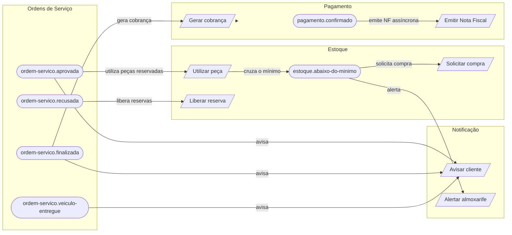

# Mapa de Contexto — Eventos entre Bounded Contexts

Visão da comunicação **orientada a eventos** entre os contextos da oficina. Cada seta
representa um Evento de Domínio publicado por um contexto e a Política que reage nele,
disparando um comando em outro contexto. (Ver `start/eventos.ts` e `app/politicas`.)

## Diagrama

## Tabela evento → política

| Evento (origem)                  | Política → comando (destino)                    |
| -------------------------------- | ----------------------------------------------- |
| `ordem-servico.aprovada`         | Utilizar peças reservadas (Estoque) + avisar cliente |
| `ordem-servico.recusada`         | Liberar reservas das peças (Estoque)            |
| `ordem-servico.finalizada`       | Gerar cobrança (Pagamento) + avisar cliente     |
| `ordem-servico.veiculo-entregue` | Avisar cliente                                  |
| `pagamento.confirmado`           | Emitir Nota Fiscal (Pagamento) — assíncrono     |
| `estoque.abaixo-do-minimo`       | Solicitar compra (Estoque) + alertar almoxarife |

## Eventos publicados por contexto (catálogo)

- **Clientes:** `clientes.cadastrado`, `clientes.busca-realizada`
- **Veículos:** `veiculos.cadastrado`, `veiculos.vinculado-ao-cliente`, `veiculos.busca-realizada`
- **Serviços:** `servicos.cadastrado`, `servicos.inativado`, `servicos.preco-atualizado`
- **Estoque:** `estoque.peca-cadastrada`, `estoque.peca-reservada`, `estoque.peca-utilizada`,
  `estoque.abaixo-do-minimo`, `estoque.compra-solicitada`, `estoque.peca-recebida`
- **Ordens de Serviço:** `ordem-servico.aberta`, `ordem-servico.diagnostico-iniciado`,
  `ordem-servico.orcamento-gerado`, `ordem-servico.aprovada`, `ordem-servico.recusada`,
  `ordem-servico.finalizada`, `ordem-servico.veiculo-entregue`
- **Pagamento:** `pagamento.cobranca-gerada`, `pagamento.desconto-aplicado`,
  `pagamento.confirmado`, `pagamento.nota-emitida`

> Nem todo evento tem uma Política hoje (vários são pontos de extensão para integrações
> futuras — relatórios, modelos de leitura, notificações adicionais).
</content>
